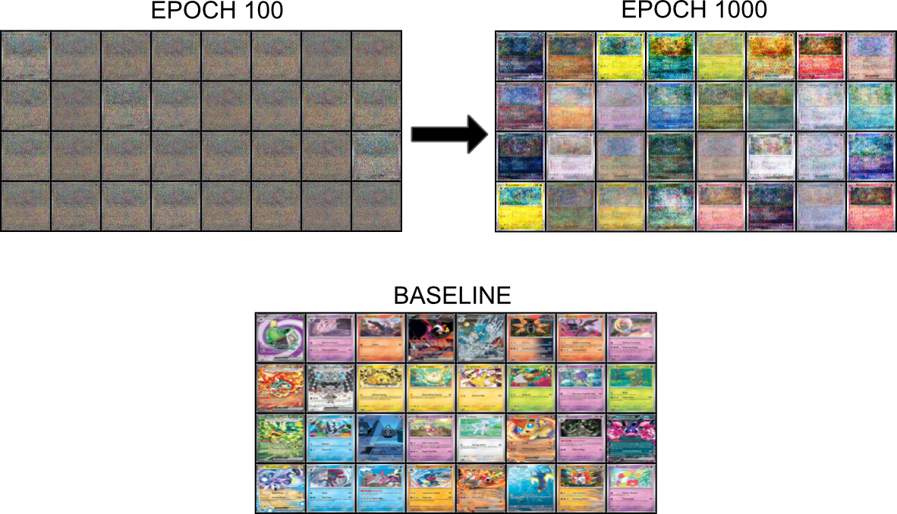

## V1
Generative Adversarial Network for 64 x 64 colored images, trained on game cards. The ensemble model consists of two competing fully connected models, a discriminator and a generator. The generator starts with a latent random noise vector, and is built up to a full image. The discriminator uses BCELoss 

    

### Results

Below a batch of results can be seen at the begining stages of training, and after about 1000 epochs. The model is clearly training, and you can begin to see cards forming, although a clearer image is likley too complex for this model to produce.

